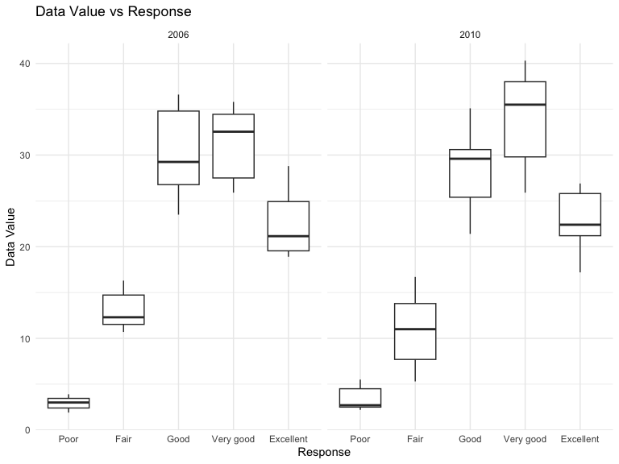
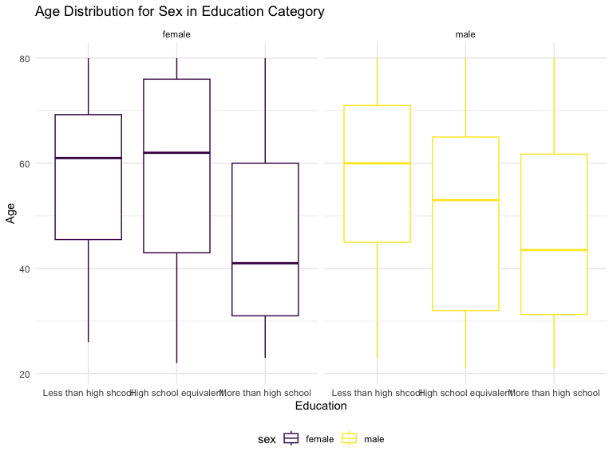

p8105_hw3_zl2746
================
Ze Li
2023-10-10

## Problem 1

#### Read in the data

``` r
data("instacart")

instacart = 
  instacart |> 
  as_tibble()
```

#### Answer questions about the data

This dataset contains 1384617 rows and 15 columns, with each row
resprenting a single product from an instacart order. Variables include
identifiers for user, order, and product; the order in which each
product was added to the cart. There are several order-level variables,
describing the day and time of the order, and number of days since prior
order. Then there are several item-specific variables, describing the
product name (e.g. Yogurt, Avocado), department (e.g. dairy and eggs,
produce), and aisle (e.g. yogurt, fresh fruits), and whether the item
has been ordered by this user in the past. In total, there are 39123
products found in 131209 orders from 131209 distinct users.

Below is a table summarizing the number of items ordered from aisle. In
total, there are 134 aisles, with fresh vegetables and fresh fruits
holding the most items ordered by far.

``` r
instacart |> 
  count(aisle) |> 
  arrange(desc(n))
```

    ## # A tibble: 134 × 2
    ##    aisle                              n
    ##    <chr>                          <int>
    ##  1 fresh vegetables              150609
    ##  2 fresh fruits                  150473
    ##  3 packaged vegetables fruits     78493
    ##  4 yogurt                         55240
    ##  5 packaged cheese                41699
    ##  6 water seltzer sparkling water  36617
    ##  7 milk                           32644
    ##  8 chips pretzels                 31269
    ##  9 soy lactosefree                26240
    ## 10 bread                          23635
    ## # ℹ 124 more rows

Next is a plot that shows the number of items ordered in each aisle.
Here, aisles are ordered by ascending number of items.

``` r
instacart |> 
  count(aisle) |> 
  filter(n > 10000) |> 
  mutate(aisle = fct_reorder(aisle, n)) |> 
  ggplot(aes(x = aisle, y = n)) + 
  geom_point() + 
  labs(title = "Number of items ordered in each aisle") +
  theme(axis.text.x = element_text(angle = 60, hjust = 1))
```


Our next table shows the three most popular items in aisles
`baking ingredients`, `dog food care`, and `packaged vegetables fruits`,
and includes the number of times each item is ordered in your table.

``` r
instacart |> 
  filter(aisle %in% c("baking ingredients", "dog food care", "packaged vegetables fruits")) |>
  group_by(aisle) |> 
  count(product_name) |> 
  mutate(rank = min_rank(desc(n))) |> 
  filter(rank < 4) |> 
  arrange(desc(n)) |>
  knitr::kable()
```

| aisle                      | product_name                                  |    n | rank |
|:---------------------------|:----------------------------------------------|-----:|-----:|
| packaged vegetables fruits | Organic Baby Spinach                          | 9784 |    1 |
| packaged vegetables fruits | Organic Raspberries                           | 5546 |    2 |
| packaged vegetables fruits | Organic Blueberries                           | 4966 |    3 |
| baking ingredients         | Light Brown Sugar                             |  499 |    1 |
| baking ingredients         | Pure Baking Soda                              |  387 |    2 |
| baking ingredients         | Cane Sugar                                    |  336 |    3 |
| dog food care              | Snack Sticks Chicken & Rice Recipe Dog Treats |   30 |    1 |
| dog food care              | Organix Chicken & Brown Rice Recipe           |   28 |    2 |
| dog food care              | Small Dog Biscuits                            |   26 |    3 |

Finally is a table showing the mean hour of the day at which Pink Lady
Apples and Coffee Ice Cream are ordered on each day of the week. This
table has been formatted in an untidy manner for human readers. Pink
Lady Apples are generally purchased slightly earlier in the day than
Coffee Ice Cream, with the exception of day 5.

``` r
instacart |>
  filter(product_name %in% c("Pink Lady Apples", "Coffee Ice Cream")) |>
  group_by(product_name, order_dow) |>
  summarize(mean_hour = mean(order_hour_of_day)) |>
  pivot_wider(
    names_from = order_dow, 
    values_from = mean_hour) |>
  knitr::kable(digits = 2)
```

    ## `summarise()` has grouped output by 'product_name'. You can override using the
    ## `.groups` argument.

| product_name     |     0 |     1 |     2 |     3 |     4 |     5 |     6 |
|:-----------------|------:|------:|------:|------:|------:|------:|------:|
| Coffee Ice Cream | 13.77 | 14.32 | 15.38 | 15.32 | 15.22 | 12.26 | 13.83 |
| Pink Lady Apples | 13.44 | 11.36 | 11.70 | 14.25 | 11.55 | 12.78 | 11.94 |

## Problem 2

First, do some data cleaning:

- format the data to use appropriate variable names;
- focus on the “Overall Health” topic
- include only responses from “Excellent” to “Poor”
- organize responses as a factor taking levels ordered from “Poor” to
  “Excellent”

``` r
data("brfss_smart2010")

brfss_smart = 
  brfss_smart2010 |>
  janitor::clean_names() |>
  rename(state = locationabbr, location_state = locationdesc) |>
  filter(topic %in% "Overall Health") |>
  mutate(response = fct_relevel(response, "Poor","Fair","Good","Very good","Excellent")) |>
  filter(response %in% c("Poor","Excellent")) 
```

### In 2002, which states were observed at 7 or more locations? What about in 2010?

In 2002,

``` r
brfss_smart |>
  filter(year == "2002") |>
  group_by(year,state) |>
  count(state) |> 
  filter(n >= 7) |> #view()
  pivot_wider(
    names_from = year, 
    values_from = state) |>
  knitr::kable()
```

|   n | 2002                       |
|----:|:---------------------------|
|   8 | CO, HI, MI, MN, OH, RI, WA |
|  14 | CT, FL, NC                 |
|  16 | MA, NJ                     |
|  12 | MD                         |
|  10 | NH, NY, UT                 |
|  20 | PA                         |

In 2010,

``` r
brfss_smart |>
  group_by(year,state) |>
  count(state) |>
  filter(n >= 7) |>
  filter(year == "2010") |>
  pivot_wider(
    names_from = year, 
    values_from = state) |>
  knitr::kable()
```

|   n | 2010                   |
|----:|:-----------------------|
|  24 | CA, MD, NC             |
|  14 | CO, PA, SC             |
|  10 | CT, LA, MN, NH, RI, TN |
|  82 | FL                     |
|   8 | GA, HI, KS, MI, OR     |
|  12 | ID, ME, NM, UT, VT     |
|  18 | MA, NY                 |
|  20 | NE, WA                 |
|  38 | NJ                     |
|  16 | OH                     |
|  32 | TX                     |

### Construct a dataset that is limited to `Excellent` responses, and contains, year, state, and a variable that averages the `data_value` across locations within a state. Make a “spaghetti” plot of this average value over time within a state (that is, make a plot showing a line for each state across years – the `geom_line` geometry and `group` aesthetic will help).

``` r
brfss_smart |>
  filter(response == "Excellent") |>
  group_by(state,year) |>
  summarize(mean_datavalue = mean(data_value)) |> 
  ggplot(aes(x = year, y = mean_datavalue, group = state, color = state)) + 
  geom_line() + 
  labs(
    title = "Time vs Mean Data Value",
    x = "Year",
    y = "Average Data Value") + 
  theme(legend.position = "right")
```

    ## `summarise()` has grouped output by 'state'. You can override using the
    ## `.groups` argument.


### Make a two-panel plot showing, for the years 2006, and 2010, distribution of data_value for responses (“Poor” to “Excellent”) among locations in NY State.

``` r
brfss_smart |>
  filter(state %in% "NY") |>
  filter(year %in% c("2006","2010")) |>
  ggplot(aes(x = response, y = data_value)) + 
  geom_boxplot() + 
  facet_grid(. ~ year) +
  labs(
    x = "Response",
    y = "Data Value",
    title = "Data Value vs Response"
  )
```



## Problem 3

- Load, tidy, merge, and otherwise organize the data sets.

- Your final dataset should include all originally observed variables;

- exclude participants less than 21 years of age, and those with missing
  demographic data;

- and encode data with reasonable variable classes (i.e. not numeric,
  and using factors with the ordering of tables and plots in mind).

``` r
nhanes_covar = 
  read_csv("nhanes_covar.csv",skip = 4) |>
  janitor::clean_names() |>
  filter(age > 21) |>
  mutate(
    sex = recode(sex, "1" = "male", "2" = "female"),
    education = recode(
      education, 
      "1" = "Less than high shcool", 
      "2" = "High school equivalent",
      "3" = "More than high school"),
    education = factor(education, levels=c("Less than high shcool","High school equivalent", "More than high school"))
  ) |>
  drop_na()
```

    ## Rows: 250 Columns: 5
    ## ── Column specification ────────────────────────────────────────────────────────
    ## Delimiter: ","
    ## dbl (5): SEQN, sex, age, BMI, education
    ## 
    ## ℹ Use `spec()` to retrieve the full column specification for this data.
    ## ℹ Specify the column types or set `show_col_types = FALSE` to quiet this message.

``` r
nhanes_accel = 
  read_csv("nhanes_accel.csv") |>
  janitor::clean_names() |>
  pivot_longer(
    min1:min1440,
    values_to = "MIMS_Value",
    names_to = "minutes"
  )
```

    ## Rows: 250 Columns: 1441
    ## ── Column specification ────────────────────────────────────────────────────────
    ## Delimiter: ","
    ## dbl (1441): SEQN, min1, min2, min3, min4, min5, min6, min7, min8, min9, min1...
    ## 
    ## ℹ Use `spec()` to retrieve the full column specification for this data.
    ## ℹ Specify the column types or set `show_col_types = FALSE` to quiet this message.

``` r
nhanes_df = left_join(nhanes_covar,nhanes_accel,by = "seqn")
```

### Produce a reader-friendly table for the number of men and women in each education category, and create a visualization of the age distributions for men and women in each education category.

``` r
nhanes_df |>
  group_by(sex,education) |>
  summarize(n = n()/1440) |>
  pivot_wider(
    names_from = sex,
    values_from = n
  ) |>
  knitr::kable()
```

    ## `summarise()` has grouped output by 'sex'. You can override using the `.groups`
    ## argument.

| education              | female | male |
|:-----------------------|-------:|-----:|
| Less than high shcool  |     28 |   27 |
| High school equivalent |     23 |   34 |
| More than high school  |     59 |   54 |

``` r
nhanes_df |>
  ggplot(aes(x = age, y = education, color = sex)) +
  geom_boxplot() +
  facet_grid(. ~ sex) +
  labs(
    title = "Age Distribution for Sex in Education Category",
    x = "Age",
    y = "Education"
  )
```



Comment on these items.

### Using your tidied dataset, aggregate across minutes to create a total activity variable for each participant. Plot these total activities (y-axis) against age (x-axis); your plot should compare men to women and have separate panels for each education level. Include a trend line or a smooth to illustrate differences.

``` r
nhanes_df |>
  group_by(seqn) |>
  mutate(aggr_act = sum(MIMS_Value)) |>
  ggplot(aes(x = age, y = aggr_act, color = sex)) +
  geom_point() +
  geom_smooth(se = FALSE) +
  facet_grid(. ~ education)
```

    ## `geom_smooth()` using method = 'gam' and formula = 'y ~ s(x, bs = "cs")'


Comment on your plot.

### Accelerometer data allows the inspection activity over the course of the day. Make a three-panel plot that shows the 24-hour activity time courses for each education level and use color to indicate sex. Describe in words any patterns or conclusions you can make based on this graph; including smooth trends may help identify differences.

``` r
nhanes_df |>
  mutate(
    minutes = str_remove_all(minutes,"min"),
    minutes = as.numeric(minutes)
  ) |>
  ggplot(aes(x = minutes, y = MIMS_Value, color = sex)) +
  geom_point(alpha = .5) +
  geom_smooth(se = FALSE) +
  facet_grid(. ~ education) 
```

    ## `geom_smooth()` using method = 'gam' and formula = 'y ~ s(x, bs = "cs")'


